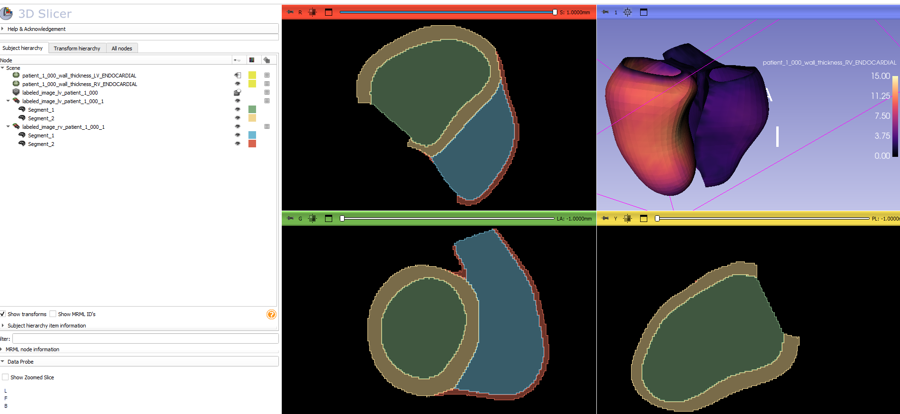

<div align="center">

# Biventricular model fitting framework

[](https://opensource.org/licenses/Apache-2.0)
  
[](https://github.com/UOA-Heart-Mechanics-Research/biv-me/actions/workflows/macos.yml)

  
[](https://github.com/UOA-Heart-Mechanics-Research/biv-me/actions/workflows/linux.yml)

  
[](https://github.com/UOA-Heart-Mechanics-Research/biv-me/actions/workflows/windows.yml)

</div>

This repository provides a full pipeline for generating **guide point files (GPFiles)** from DICOM data, fitting **biventricular models**, and computing **functional cardiac metrics** such as volumes, strains, and wall thickness.

Example data is available in the `example/` folder, including input DICOMs, output GPFiles, configuration files, and results for testing and reference.

For a detailed description of the full pipeline, please refer to:
**Dillon JR, Mauger C, Zhao D, Deng Y, Petersen SE, McCulloch AD, Young AA, Nash MP. An open-source end-to-end pipeline for generating 3D+t biventricular meshes from cardiac magnetic resonance imaging. In: Functional Imaging and Modeling of the Heart (FIMH) 2025. (in press)**

For a detailed description regarding the fitting of the biventricular model, please refer to:
**Mauger, C., Gilbert, K., Suinesiaputra, A., Pontre, B., Omens, J., McCulloch, A., & Young, A. (2018, July). An iterative diffeomorphic algorithm for registration of subdivision surfaces: application to congenital heart disease. In 2018 40th Annual International Conference of the IEEE Engineering in Medicine and Biology Society (EMBC) (pp. 596-599). IEEE.** [DOI: 10.1109/EMBC.2018.8512394](https://doi.org/10.1109/EMBC.2018.8512394)

## 🚀 Installation Guide
-----------------------------------------------

The easiest way to get this repo setup is to use the provided conda environment (python 3.11).
The conda environment named biv311 can be created and activated with

### Step 1: Clone this repository
```bash
git clone https://github.com/UOA-Heart-Mechanics-Research/biv-me.git
```

### Step 2: Setup the virtual environment
```bash
cd biv-me
conda create -n bivme311 python=3.11
conda activate bivme311
```

### Step 3: Install the bivme packages
```bash
pip install -e .
python src/pyezzi/setup.py build_ext --inplace
```

## Usage

-----------------------------------------------
### (Preprocessing) Create GP files from DICOM files
If you do not already have them, guidepoint files (GPFiles) for personalised biventricular mesh fitting can be generated directly from DICOM files.

## Download models
The preprocessing pipeline uses deep learning models for view prediction and segmentation. These can be downloaded from ([here](https://www.dropbox.com/scl/fo/54662zpqpb0ibmoysqy54/AF4eN0-Bzmb7O-l1lJ6WCZI?rlkey=wxahs4jcepd8ryhh0nfersne2&st=75oy73u9&dl=0)). They should be placed in the biv-me repository like so:

    ```
    src 
    └─── bivme
        └─── preprocessing
            └─── dicom
                └─── models
                    └─── Segmentation
                    └─── ViewSelection
    ```

## Import libraries
This preprocessing pipeline utilises PyTorch and nnU-Net. The default biv-me conda environment currently doesn't install either of these for you. To set these up, activate the biv-me conda environment, like so:

```
conda activate bivme311
```

Then, find the PyTorch right version for your GPU and OS ([here](https://pytorch.org/get-started/locally/)) and install it as described on the website.

After PyTorch has been installed, install nnU-Net like so:

```
pip install nnunetv2
```

## Run preprocessing pipeline
The main script for running the preprocessing pipeline can be found in src/bivme/preprocessing/dicom. This runs the pipeline on the DICOM directory you provide it. No prior organisation of DICOM files are required, other than to separate into one folder per case, like so:

    ```
    DICOM directory
    └─── case1
        │─── *
    └─── case2
        │─── *
    └─── ...
    ```

The output is a set of GPFiles (GPFile_000.txt for frame 0, GPFile_001.txt for frame 1...) for each frame of each case, which can be used for fitting (see next section).

```
usage: run_pipeline.py [-h] [-config CONFIG_FILE]

Preprocess DICOM files for fitting

options:
  -h, --help            show this help message and exit
  -config CONFIG_FILE, --config_file CONFIG_FILE
                        Config file containing preprocessing parameters

```
An example of a config file can be found in src/bivme/preprocessing/dicom/configs/preprocessing-config.toml. 

You can also run the preprocessing from a Jupyter notebook, in the same directory, named run_pipeline_interactive.ipynb. This notebook runs case by case. It is particularly useful if you would like some tighter supervision over certain aspects, such as the view selection. 

### Fit a Biv-me model to GP files
The script for the mesh fitting can be found in src/bivme/fitting
```
usage: perform_fit.py [-h] [-config CONFIG_FILE]

Biv-me

options:
  -h, --help            show this help message and exit
  -config CONFIG_FILE, --config_file CONFIG_FILE
                        Config file containing fitting parameters

```
An example of a config file can be found in src/bivme/configs/config.toml. The gp_directory should contain one subfolder for each patient. Each subfolder should contain a set of GPFiles (GPFile_000.txt for frame 0, GPFile_001.txt for frame 1...) and one SliceInfoFile.txt relative to one patient. See example in the example folder.

### Calculate volumes from biv-me models
The script for the volume calculation can be found in src/bivme/analysis

```
usage: compute_volume.py [-h] [-mdir MODEL_DIR] [-o OUTPUT_FILE] [-b BIV_MODEL_FOLDER] [-pat PATTERNS] [-p PRECISION]

  -h, --help            show this help message and exit
  -mdir MODEL_DIR, --model_dir MODEL_DIR
                        path to biv models
  -o OUTPUT_FILE, --output_file OUTPUT_FILE
                        output path
  -b BIV_MODEL_FOLDER, --biv_model_folder BIV_MODEL_FOLDER
                        folder containing subdivision matrices (default: src/model) 
  -pat PATTERNS, --patterns PATTERNS
                        folder patterns to include (default '*')
  -p PRECISION, --precision PRECISION
                        Output precision (default: 2)
```

Results will be saved in {OUTPUT_PATH}/lvrv_volumes.csv.

### Calculate strains from biv-me models
The script for strain calculation can be found in src/bivme/analysis. Geometric strain is defined as the change in geometric arc length from ED to ES using a set of predefined points and calculated using the Cauchy strain formula.

**For global circumferential strain calculation**
```
usage: compute_global_circumferential_strain.py [-h] [-mdir MODEL_DIR] [-o OUTPUT_PATH] [-b BIV_MODEL_FOLDER] [-pat PATTERNS] [-ed ED_FRAME]
                                                [-p PRECISION]

Global circumferential strain calculation

options:
  -h, --help            show this help message and exit
  -mdir MODEL_DIR, --model_dir MODEL_DIR
                        path to biv models
  -o OUTPUT_PATH, --output_path OUTPUT_PATH
                        output path
  -b BIV_MODEL_FOLDER, --biv_model_folder BIV_MODEL_FOLDER
                        folder containing subdivision matrices
  -pat PATTERNS, --patterns PATTERNS
                        folder patterns to include (default '*')
  -ed ED_FRAME, --ed_frame ED_FRAME
                        ED frame
  -p PRECISION, --precision PRECISION
                        Output precision


```
Results will be saved in {OUTPUT_PATH}/global_circumferential_strain.csv

**For global longitudinal strain calculation**
```
usage: compute_global_longitudinal_strain.py [-h] [-mdir MODEL_DIR] [-o OUTPUT_PATH] [-b BIV_MODEL_FOLDER] [-pat PATTERNS] [-ed ED_FRAME]
                                             [-p PRECISION]

Global longitudinal strain calculation

options:
  -h, --help            show this help message and exit
  -mdir MODEL_DIR, --model_dir MODEL_DIR
                        path to biv models
  -o OUTPUT_PATH, --output_path OUTPUT_PATH
                        output path
  -b BIV_MODEL_FOLDER, --biv_model_folder BIV_MODEL_FOLDER
                        folder containing subdivision matrices
  -pat PATTERNS, --patterns PATTERNS
                        folder patterns to include (default '*')
  -ed ED_FRAME, --ed_frame ED_FRAME
                        ED frame
  -p PRECISION, --precision PRECISION
                        Output precision

```
Results will be saved in {OUTPUT_PATH}/global_longitudinal_strain.csv

### Compute wall thickness
The script for computing the wall thickness can be found in src/bivme/analysis. Wall thickness is calculated on binary 3D images using [pyezzi](https://pypi.org/project/pyezzi/) for both LV and RV separately. The septal wall is included in the LV calculation and excluded from the RV 

The following command generate 2 .vtk files (one for the LV chamber and the other for the RV chamber) per input model in `path/to/my/fitted/model/directory/wall_thickness`. Each case will have its own subfolder. Wall thickness is sampled and saved at the location of each vertex and can be visualised in Paraview as vertex color.

```
python compute_wall_thickness.py -mdir path/to/my/fitted/model/directory -o path/to/my/output/folder
```

Adding the `-s` flag to the above command will also generate 4 extra nifti files per model: 2 3D masks with background=0, cavity=1, and wall=2 (`labeled_image_lv*.nii` and `labeled_image_lv*.nii`) and 2 3D mask containing thickness values at each voxel (`lv_thickness*.nii` and `rv_thickness*.nii`).
```
python compute_wall_thickness.py -mdir path/to/my/fitted/model/directory -o path/to/my/output/folder -s
```



### Remove intersection from biv-me models (experimental feature)
Diffeomorphic constraints are on the myocardium only. It can happend that the RV septum and RVFW intersect if the contours are too close. This script re-fit the models, using an extra collision detection step. An inital fit of the model is required as this will be used as guide points.

The script for the mesh fitting can be found in src/bivme/postprocessing
```
usage: detect_intersection.py [-h] [-config CONFIG_FILE]

Biv-me

options:
  -h, --help            show this help message and exit
  -config CONFIG_FILE, --config_file CONFIG_FILE
                        Config file containing fitting parameters

```

The config file should be the one used to fit the original models. Refitted models will be saved in config["output"]["output_directory"]/corrected_models.


Contribution - Notation
-----------------------------------------------
If you wish to contribute to this project, we ask you to follow the naming conventions below :
- **Variable**: use lowercase word. A variable that use multiple words should be separated with an underscore (snake case)
```sitename``` should be written as ```site_name```
- **Function and Method**: function/method names should follow the PEP 8 naming conventions ```def MyFunction()``` should be written as ```def my_function()```
- **Constant**: constant names should be written in uppercase letters with underscores separating words ```MYCONSTANT = 3.1416``` should be written ```MY_CONSTANT = 3.1416```
- **Class**; class names should follow the CamelCase convention: ```class myclass:``` should be written as ```class MyClass:```
- **Package and Module** : Avoid using underscores or hyphens in package names to maintain consistency with the Python standard library and third-party packages. ```my_package_name_with_underscores = ...``` should be written ```mypackage = ...```
- **Type variable**: follow the convention of using CamelCase with a leading capital letter: ```def my_function(items: dict[int, str]):``` should be written as ```def my_function(items: Dict[int, str]):```
- **Exception** exception names should have the suffix “Error.”: ```class MyCustomException:``` should be ```class MyCustomExceptionError:```
- Stick to ASCII characters to ensure smooth collaboration and consistent code execution: avoid for example ```ç = 42```. Instead prefer ```count = 42```
- Use type hints for code readability and prevent type-related errors.
```
def greet(name):
    return "Hello, " + name
```
should be
```
def greet(name: str) -> str:
    return "Hello, " + name
```


## Acknowledgments
------------------------------------
Based on work by: Laura Dal Toso, Anna Mira, Liandong Lee, Richard Burns, Joshua Dillon, Charlene Mauger


## Contact
For questions or issues, please open an issue on GitHub or contact [joshua.dillon@auckland.ac.nz](joshua.dillon@auckland.ac.nz) or [charlene.1.mauger@kcl.ac.uk](charlene.1.mauger@kcl.ac.uk) 
